```{=latex}
\newpage
```

# Introduction

A finding rarely survives retelling intact. As a result moves from the analysis to the abstract to the
headline, its conditions fall away, and a claim that began as tentative comes to sound certain. The
same number, framed one way, points to individual responsibility; framed another way, it indicts
institutions, even though nothing underneath has changed. Quantitative social science is especially
exposed to this, because a single summary figure can quietly carry all the choices that produced it.

This paper takes that vulnerability as its subject. On the surface it asks a substantive question:
across the U.S. states, does a healthier democracy go together with less racial inequality in
punishment, and can restoring the vote to people with felony convictions change anything? Underneath,
though, the argument is methodological, because at every step the answer turns on a decision that is
easy to make without noticing. Which measure of inequality should be reported? Should states be
compared with one another, or each state with itself over time? How many groups should be read into
the data? And is a reform "large" by its text or by its effect? Each of these choices, it turns out,
can flip the conclusion.

The paper proceeds in four demonstrations, and each one revises the one before it.

- The first measures racial inequality across states. By one common measure, more democratic states
  look more unequal; by three others, they look the same or better.
- The second compares each state with itself over time, and the cross-state result largely dissolves.
- The third sorts states into trajectory types. The types are real enough to describe, but the method
  reads in more structure than the data can support.
- The fourth treats Florida's 2018 voting-rights reform as a natural experiment. By its text it freed
  1.4 million voters; by its effect it changed almost nothing.

The point is not any single number, but the pattern across them: measurement, design, and framing
decide what we are able to conclude, and careful choices keep overturning the answer that looked settled. The
case, race and democracy and punishment, matters in its own right, yet here it mainly serves to make
that methodological lesson concrete.

# Background

## Measurement, framing, and what counts as a finding

A claim about inequality is never simply a reading of the evidence. It is also a product of the
choices made in turning evidence into a number, and a number into a sentence. Scholars writing under
banners such as data feminism and QuantCrit have pressed this point in recent years, arguing that data
are not neutral and that statistics, far from speaking for themselves, carry the assumptions of
whoever collected, classified, and summarized them (D'Ignazio & Klein, 2020; Gillborn, Warmington, &
Demack, 2018). The complaint is not that quantification is worthless but that it hides its own
premises. Measurement of inequality is a clear example: faced with the same data, an analyst can often
choose the measure that best supports a preferred conclusion, and the decision between an absolute and
a relative measure alone can send a trend in opposite directions (Kjellsson, Gerdtham, & Petrie, 2015;
Moonesinghe & Beckles, 2015). Framing does comparable work even when the numbers are held fixed.
Describing a gap as one of "achievement" rather than "opportunity," for instance, shifts where readers
locate its causes, away from structures and toward individuals, without altering a single statistic
(Quinn, 2025). And as a result travels outward from the model that produced it, the qualifications
that gave it meaning tend to drop away, so that a conditional finding begins to circulate as a settled
fact (van der Bles, van der Linden, Freeman, & Spiegelhalter, 2020; Merry, 2016).

As a principle, none of this is new. What it has lacked is a compact, concrete demonstration: a single
consequential question carried through the ordinary choices an analyst makes, with the answer shown to
move at each step. That is what this paper sets out to provide. It takes one case and walks it through
four routine decisions, treating each decision as part of the analysis rather than as a preliminary to
it. The contribution, then, is not the insight that measurement and framing matter, which is by now
well established, but the worked example that shows how much they matter, and how readily they
compound, once a real claim about racial inequality is at stake.

## Measuring racial disparity in incarceration

The most common summary of racial disparity in imprisonment is a single ratio, the Black imprisonment
rate divided by the white rate. Its appeal is obvious, but it is a quotient, and a quotient can change
because its numerator changes, because its denominator changes, or because of both at once. A state
can post a high ratio because it imprisons Black residents at an unusually high rate, or because it
imprisons white residents at an unusually low one, and these are very different social facts that the
ratio reports identically. Criminologists have long shown that conclusions about racial
disproportionality hinge on such choices: on how much of a gap is attributed to differential
involvement rather than to downstream processing (Beck & Blumstein, 2018), on which benchmark
population is placed in the denominator (Cesario, Johnson, & Terrill, 2019), and even on the data
source and racial-classification scheme, which can widen or narrow the measured Black/White gap
(Sabol, Johnson, & Lynch, 2025). Rather than commit to one measure in advance, this paper carries
three in parallel, the ratio, the absolute Black rate, and the gap between the Black and white rates,
and treats their disagreement as part of the evidence.

## The case: state democracy, disenfranchisement, and Florida

State democracy can be measured and tracked. The State Democracy Index scores each state on features
such as electoral participation, the fairness of district maps, and the accessibility of voting, and
those scores move over time, including downward in a subset of states (Grumbach, 2022, 2023). Criminal
disenfranchisement, meanwhile, is one of the oldest and most racially loaded boundaries on the vote.
Many states wrote or expanded these laws in the decades after the Civil War, some in terms understood
at the time as a way to limit Black political power, and the legacy persists: roughly four million
Americans remain barred from voting by a felony record, with Black citizens barred at several times
the rate of others (Manza & Uggen, 2006; The Sentencing Project, 2024). Florida concentrated this
history into a single recent episode. In 2018 its voters passed Amendment 4, restoring the vote to
about 1.4 million people upon completion of their sentences. Within months, however, the legislature
passed SB7066, which redefined "completion" to require paying all outstanding court fines and fees
first, a condition critics likened to a poll tax and a federal appeals court allowed to stand in 2020.

# Data and measures

The analysis combines three public datasets, each at the state-year level. The State Democracy Index
2.0 (Grumbach & Bitton, 2024) scores the fifty states from 2000 to 2023, with higher values meaning
more democratic. The Vera Institute's Incarceration Trends provides race-specific imprisonment rates
per 100,000; the Black and white rates used here run from 1990 to 2022. The UF Election Lab turnout
series (McDonald, 2023) gives voting-age-population (VAP) turnout for each even-year election, along
with the number of people disenfranchised by a felony record.

Because racial inequality has no single definition, the paper follows three measures side by side: the
Black/White rate ratio, the absolute Black rate, and the gap between the Black and white rates. Over
this period the national ratio sits near a median of 5.4. For the natural experiment the outcome is
VAP turnout, whose denominator is the voting-age population and so does not move mechanically when
people are re-enfranchised, and the first-stage quantity is the share of the voting-age population
disenfranchised by a felony record.

# Demonstration 1: the measure decides the sign

Begin with the question in its most direct form. For each state I average the Black/White imprisonment
ratio and the State Democracy Index over 2016 to 2020, and plot one against the other (Figure 1). The
line slopes upward: the more democratic a state is, the wider its Black/White ratio tends to be. Read
at face value, this is an uncomfortable result, because it seems to say that democratic health and
racial fairness in punishment are in tension, and that the states doing democracy best are the ones
treating Black and white residents most unequally behind bars.

::: {.content-visible when-format="pdf"}
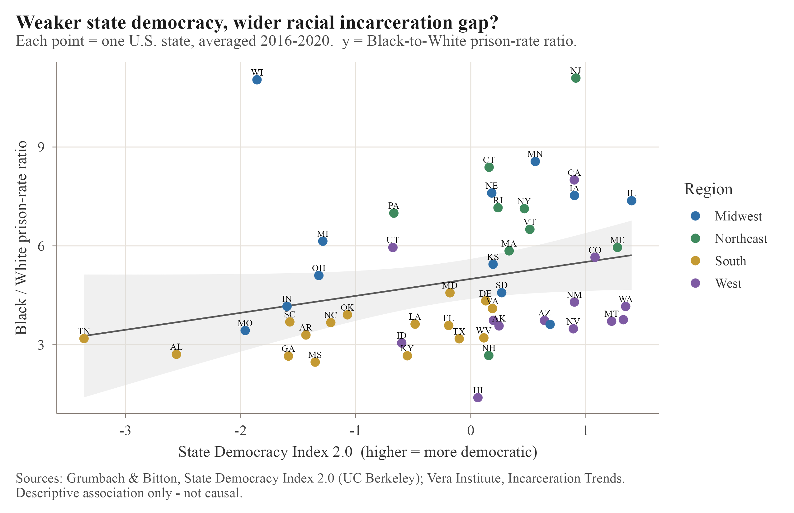{width=85%}
:::

::: {.content-visible when-format="html"}
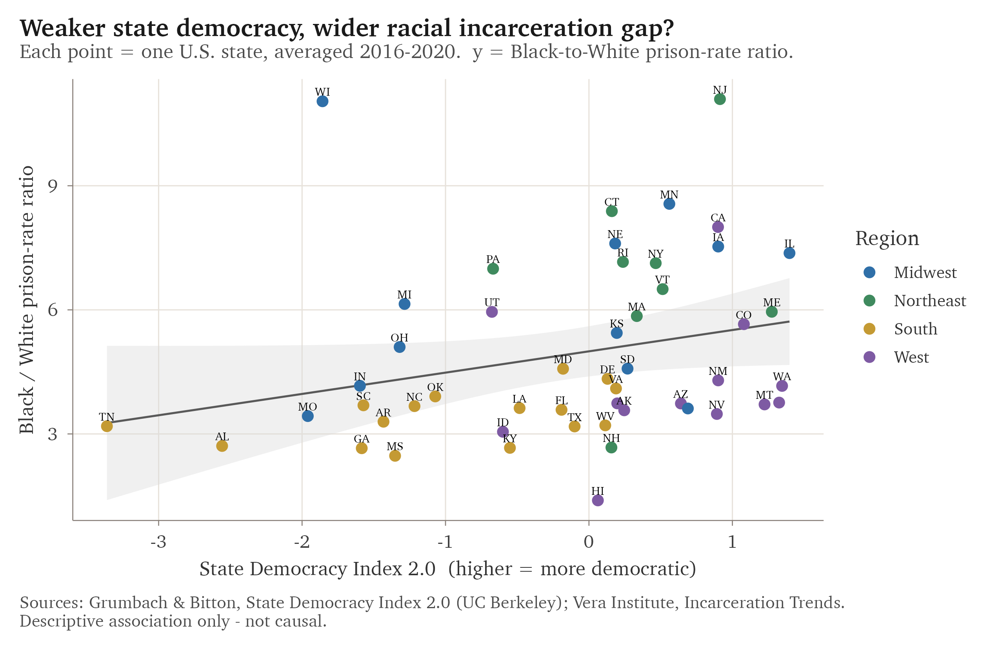{width=85%}
:::

Before accepting that, it is worth asking whether the result is a fact about the world or a fact about
the ratio. The test is simple. I hold the horizontal axis fixed, so the measure of democracy never
changes, and I substitute different measures of "racial inequality" on the vertical axis (Figure 2). If
the relationship is real, it should survive the substitution. It does not. The Black/White ratio
correlates positively with democracy, at about +0.26, which is the pattern we just saw. The absolute
Black imprisonment rate, though, correlates slightly negatively, at about −0.14, so by that measure
more democratic states imprison Black residents at marginally lower rates rather than higher ones. The
gap between the Black and white rates is essentially flat, at about −0.04. And the absolute white rate
correlates strongly negatively, at about −0.34. Four measures of the supposedly same inequality, and
they do not merely differ in strength; they point in different directions.

::: {.content-visible when-format="pdf"}
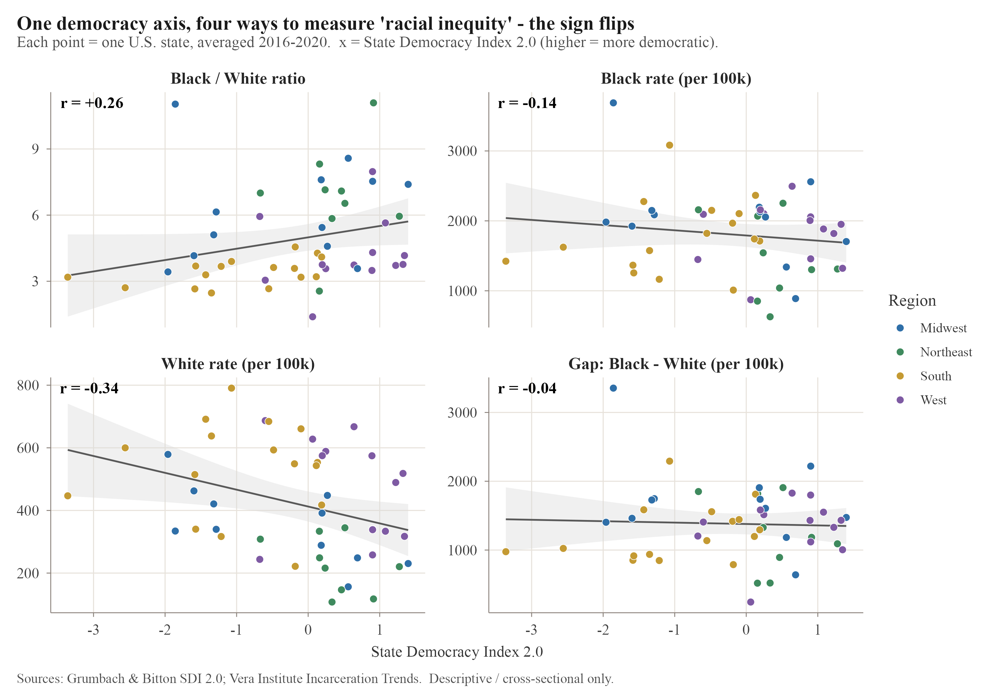{width=95%}
:::

::: {.content-visible when-format="html"}
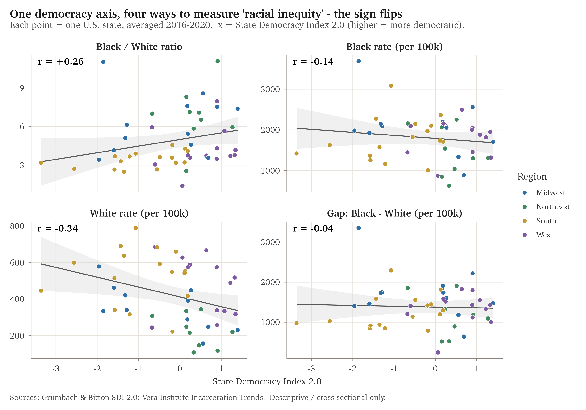{width=95%}
:::

The reason comes into focus once we look at what the ratio is made of. It is the Black rate divided by
the white rate, so its value depends as much on the denominator as on the numerator. More democratic
states, it turns out, imprison white residents at strikingly low rates, and that small denominator
does the arithmetic work, inflating the ratio even in a state where Black imprisonment is no higher
than average. The South illustrates the same mechanism in reverse. Southern states post lower ratios,
but not because they treat Black and white residents more evenly; they imprison white residents
heavily too, and the large white denominator pulls the ratio down. The regional averages put numbers
on this. White imprisonment runs about 230 per 100,000 in the more democratic Northeast and about 535
in the South, more than twice as high, while the Black rate stays within a much narrower band, roughly
1,460 to 2,060 across the four regions. The ratio therefore runs highest on average across the
low-white-rate Northeast and lowest across the high-white-rate South, even though the South is the less
democratic region. The measure reported most often,
then, is also the one most exposed to movement that has nothing to do with how Black people are
treated, since a state can climb the ratio simply by incarcerating fewer white people. Judged by the
absolute Black rate, more democratic states look slightly better; judged by the gap, they look no
different; judged by the ratio, they look worse. Nothing about the data has changed between those
three sentences. Only the measure has.

This is not a quirk of incarceration data. The divergence between absolute and relative measures of
disparity is a known formal result, demonstrated in health research where the two can move in opposite
directions over the same period (Moonesinghe & Beckles, 2015), and the dependence of measured racial
disparity on such choices has been shown directly for imprisonment (Sabol, Johnson, & Lynch, 2025).
What the figure adds is a vivid sense of how cleanly the choice can reverse a headline: one decision,
made before any modeling begins, has already settled whether democracy looks like a friend or an enemy
of racial equality.

# Demonstration 2: comparing states, or comparing a state with itself

Comparing different states with one another folds democracy together with everything else that
distinguishes them, including region, demographics, history, and the local economy, and the first
demonstration has already shown how badly that folding can distort an answer. A cleaner question is
longitudinal. When a single state's democracy rises or falls, does its incarceration move with it?
Posed this way, each state serves as its own control, and the fixed differences between states drop out
of the comparison.

To carry this out I split the democracy score into two parts. The first is each state's long-run
average, which holds the between-state variation that the earlier figures relied on; the second is
each year's deviation from that average, which holds the within-state variation that tracks change over
time. The split follows Mundlak (1978). I then fit a linear mixed model with a random intercept for
each state and a common year trend, using the lme4 package (Bates et al., 2015), so that the two kinds
of variation are estimated side by side rather than confused with each other (Figure 3).

::: {.content-visible when-format="pdf"}
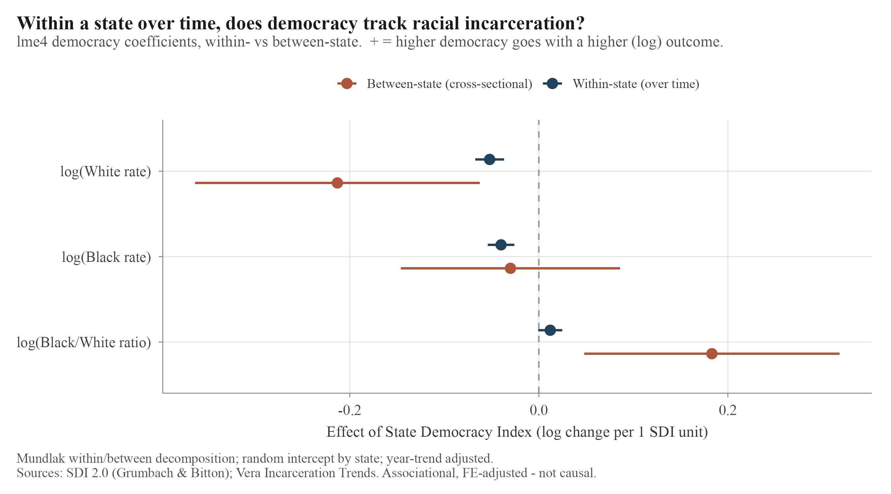{width=85%}
:::

::: {.content-visible when-format="html"}
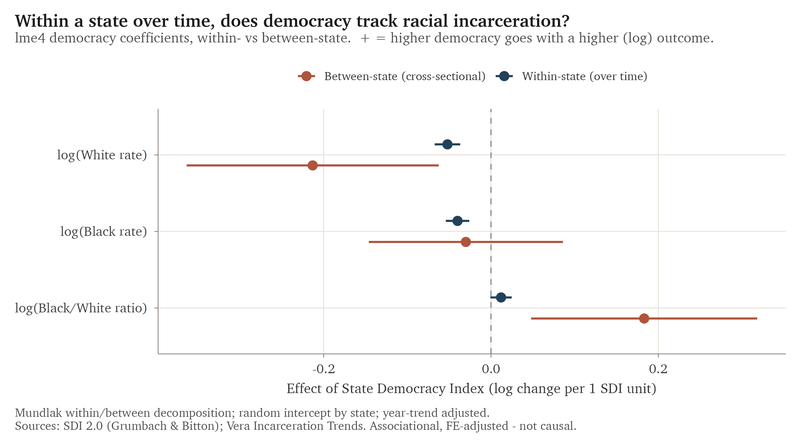{width=85%}
:::

The contrast is clean. The alarming cross-sectional result for the ratio turns out to be entirely
between-state, at about +0.18, and to vanish within states, at about +0.01. In other words, it reflects
which states are which, not what happens when a given state's democracy changes. Within states,
stronger democracy goes with lower incarceration of both groups, by roughly −0.04 for the Black rate
and −0.05 for the white rate in log points per index point, and because the two rates fall together the
ratio barely moves, exactly as the first demonstration would predict. The largest term in every model,
however, is neither within nor between democracy but the year trend: the ratio fell about 2.6 percent a
year and the Black rate about 2.7 percent, a nationwide decline that has little to do with state
democracy. An analysis that left time out would mistake that tide for its own discovery. So the
within-state link is real and consistent in direction, but it is modest, and the paper is stronger for
saying so. One choice of comparison, cross-section against within-state, has already turned a striking
effect into a small one.

# From multiverse to model

The title marks a move. The four demonstrations are a small multiverse, one question carried through
choices that should not change the answer so that the disagreements among the answers can show; this
section turns that multiverse into a single Bayesian model, in which the same choices reappear as
contrasts of one posterior. The multiverse is the better tool for revealing that the choices matter;
the model is the better tool for saying how much, and how reliably.

The first two demonstrations treated the choice of measure and the choice of comparison as
separate forks in the analysis. They are not separate. The four measures and the within and
between contrasts are all summaries of the same two underlying quantities: how heavily a state
imprisons its Black residents, how heavily it imprisons its white residents, and how each of those
moves with democracy. Rather than walk the forks one at a time, then, we can fit a single model of
those two quantities and read every fork off the one set of estimates it implies.

To do this I fit one joint multilevel model with two outcomes at once, the log Black imprisonment
rate and the log white rate, each allowed to depend on democracy. Democracy enters in the Mundlak
form of the second demonstration, split into a between-state part, a state's long-run average, and
a within-state part, its year-to-year deviation; each state keeps its own intercept, and the two
outcomes' intercepts and residuals are free to correlate. The model is Bayesian, fit with weakly
informative priors using the brms package (Bürkner, 2017), and it converged cleanly, with every
R-hat below 1.01 and no divergent transitions. The coefficients below are scaled per one standard
deviation of democracy rather than per index point, so their sizes are not directly comparable to
those in the second demonstration, but their signs and pattern are the same.

Once the model is fit, the four measures are no longer four analyses but four contrasts of one
posterior (Figure 4). Between states, a one standard deviation increase in democracy goes with
white imprisonment lower by about 0.17 log points (95 percent credible interval −0.29 to −0.05)
and Black imprisonment that is essentially flat (−0.02, −0.12 to +0.07). The ratio effect is just
the difference between these two, and it comes out positive, about +0.14 (+0.03 to +0.25), for
exactly the reason the first demonstration gave: the ratio rises not because Black imprisonment
rises but because the white denominator falls. The alarming cross-sectional pattern and the
reassuring one are the same posterior, read two ways. Within states the two rates fall together, by
about −0.02 for the Black rate and −0.03 for the white rate, with both intervals well below zero,
and the ratio barely moves, +0.01 with an interval that straddles zero, just as the second
demonstration found.

::: {.content-visible when-format="pdf"}
{width=90%}
:::

::: {.content-visible when-format="html"}
{width=90%}
:::

Holding the measures inside one model buys something the side-by-side comparison cannot. Because
every contrast is computed from the same draws, we can ask not just whether the measures disagree
but how reliably they do. The posterior probability that democracy raises the ratio while leaving
white imprisonment lower, which is the exact shape of the first demonstration's reversal, is about
0.99. The weaker version, that the ratio rises while the absolute Black rate falls, holds with
probability about 0.68, lower only because the Black rate sits close enough to flat that its sign
is uncertain. The reversal is therefore not a fragile accident of one arbitrary comparison. It is a
near-certain feature of how the two rates move, and the model lets us report it as a probability
rather than as a juxtaposition of figures.

None of this makes the relationship causal. The model rearranges the same observational evidence
more economically; it does not identify an effect. Its value is methodological. The earlier
demonstrations show, in the accessible form of a multiverse, that the answer moves with the
analyst's choices; this model shows why, by placing those choices as contrasts of a single set of
estimates, and it puts a number on how much each choice matters. A multiverse is the better way to
reveal the problem, and a model that absorbs the sources of variation is the more disciplined way
to study it (Gelman et al., 2012). The two are complementary, and the counsel to carry more than
one measure only gains force once the measures can be shown to be one model seen from different
sides.

# Demonstration 3: a method that reads in more than the data hold

An average describes the typical state but conceals the differences between states, and those
differences are part of the story. So the next question is whether states fall into recognizable types
according to how democracy and incarceration moved together. Group-based trajectory modeling,
developed in criminology by Nagin and Land (1993) to classify offending over the life course, is built
for exactly this. Using the gbmt package (Magrini, 2022), it sorts the fifty states by their joint
path from 2000 to 2022 on two series at once, democracy and the logged Black incarceration rate, and
the BIC selects five well-separated classes, with an average assignment probability near 0.99
(Figure 5).

::: {.content-visible when-format="pdf"}
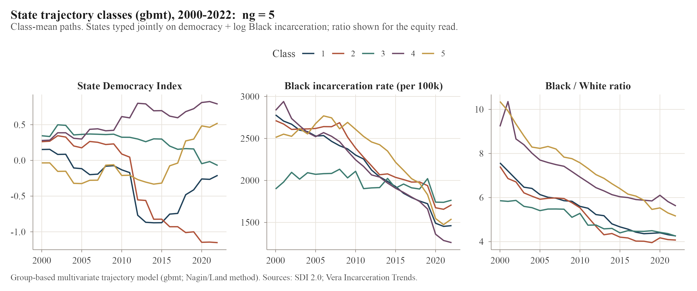{width=100%}
:::

::: {.content-visible when-format="html"}
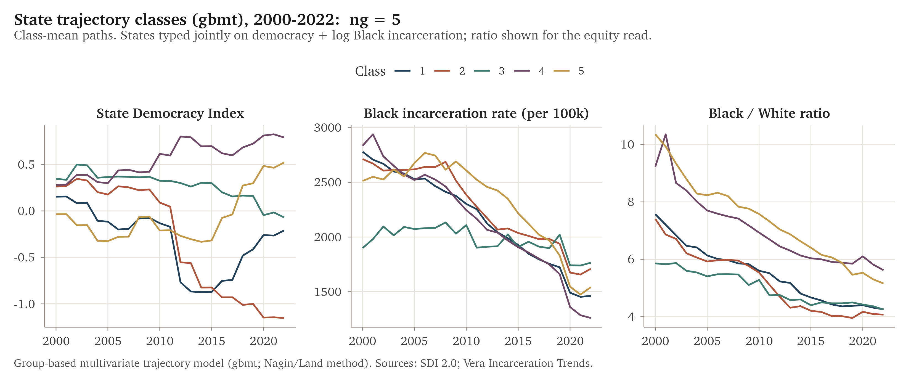{width=100%}
:::

The classes arrange themselves along a single spectrum. States that grew more democratic decarcerated
the most, while those that backslid the furthest, the group Grumbach (2023) calls the laboratories of
backsliding, reduced Black incarceration the least and even saw their white rate climb. This is the
same relationship as before, now drawn as a contrast between recognizable groups of states. The method
invites overreading, though, and resisting that is the lesson here. Every class decarcerated, because
the national decline runs through all of them, so the groups differ in degree rather than in
direction. The ratio converged toward four or five across the board. And the BIC keeps improving as
classes are added, so the figure of five is not firmly pinned down; highly autocorrelated series like
these can produce classes that are not really there. The classes are useful summaries, not natural
kinds, and they remain entangled with region. A method can hand back a clean typology that looks more
solid than the data warrant, and choosing to read it as description rather than discovery is itself
part of the analysis.

# Demonstration 4: a reform by its text, or by its effect

The state-level patterns are associations, not causes, and to get closer to cause I turn to a natural
experiment. In 2018 Florida passed Amendment 4, restoring the vote to about 1.4 million people with
felony convictions, the largest such restoration in modern U.S. history. With only one treated state
the appropriate tool is synthetic control (Abadie, Diamond, & Hainmueller, 2010), implemented with the
tidysynth package (Dunford, 2023). The method assembles a synthetic Florida from a weighted combination
of states that did not change their felon-voting laws, chosen so that the combination reproduces
Florida's turnout history before the reform, and then reads the reform's effect as the gap that opens
afterward. The outcome is VAP turnout, whose denominator does not move when people are re-enfranchised,
and a placebo test provides inference by asking how unusual Florida's gap is against the same gaps
computed for every donor state.

::: {.content-visible when-format="pdf"}
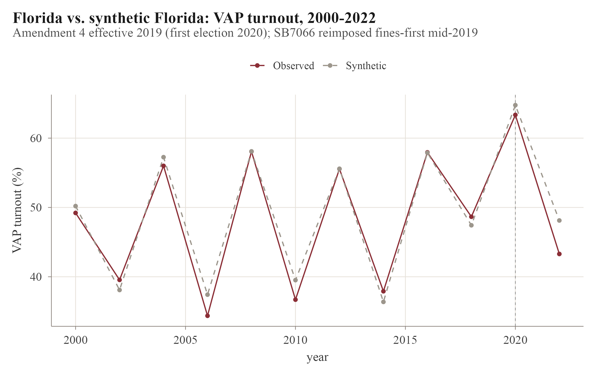{width=80%}
:::

::: {.content-visible when-format="html"}
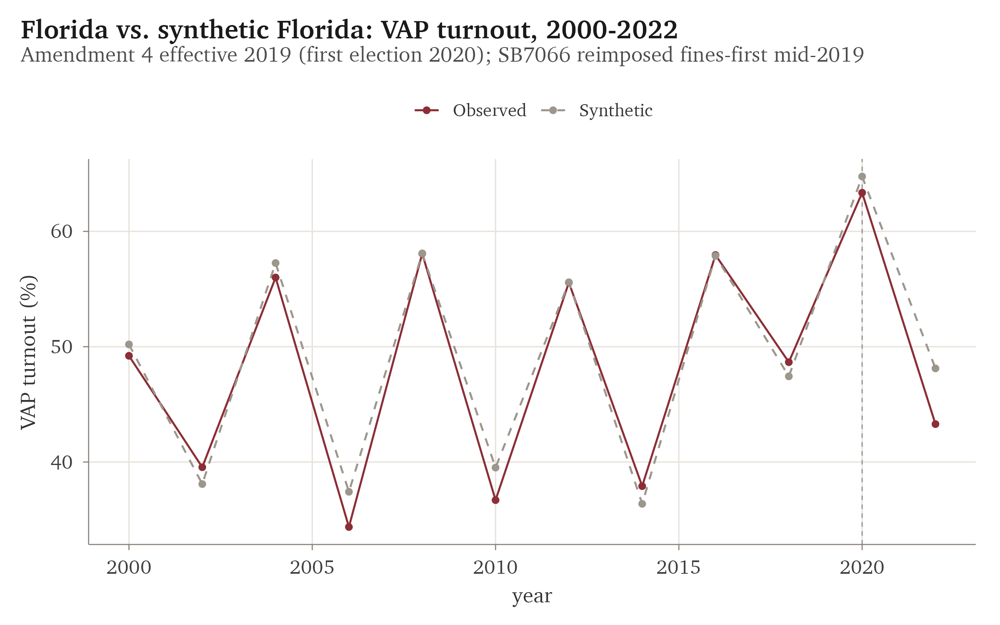{width=80%}
:::

::: {.content-visible when-format="pdf"}
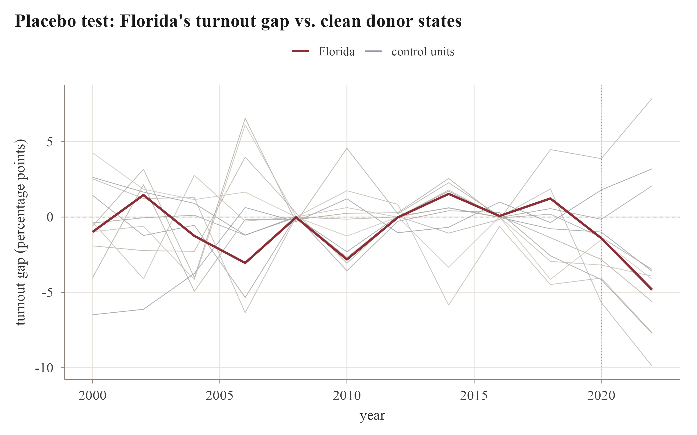{width=80%}
:::

::: {.content-visible when-format="html"}
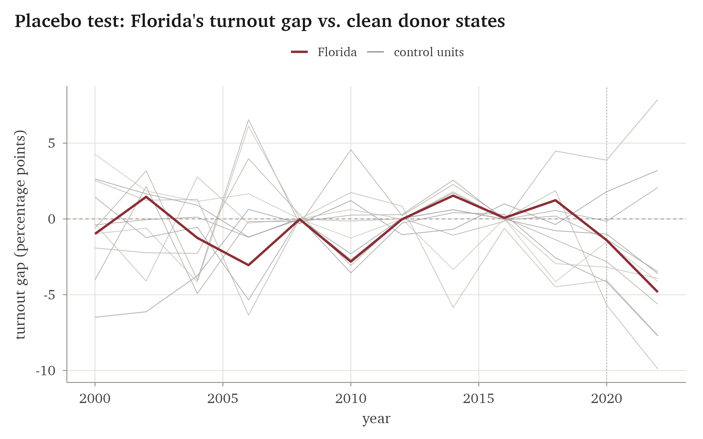{width=80%}
:::

The pre-reform fit is close, with a 2016 gap of only 0.07 points, which lends the comparison
credibility (Figure 6). After the reform, the gaps are −1.4 points in 2020 and −4.8 in 2022, both
negative rather than positive, and the placebo test returns a p-value of about 0.14, meaning Florida is
not unusual among the donor states (Figure 7). Amendment 4 produced no measurable increase in turnout.

Two further checks indicate the null is robust rather than an artifact of the specification. An in-time
placebo that moves the treatment back to 2016, before the reform, yields only small gaps in the
genuinely pre-treatment years, about +1.0 points in 2016 and +2.1 in 2018; these are modest and
positive, the opposite sign of the post-reform gaps, so the design does not manufacture the result,
though the 2018 gap signals a mild pre-existing drift. A leave-one-out analysis that re-fits the model
dropping each weighted donor in turn, with synthetic Florida drawing mainly on Arizona and New
Hampshire, leaves the 2020 gap between −1.6 and +1.1 points and the 2022 gap between −5.4 and +1.3,
straddling zero in every case, so no single donor drives the estimate. The negative 2022 gap is
therefore best read as a fluctuation around zero rather than as turnout suppression: it is not
statistically distinguishable from zero and reverses when individual donors are removed.

A null result is only worth reporting if its source is visible, and here it is. The reform barely took
effect. Florida's disenfranchised share fell only from 1.25 percent of the voting-age population in
2018 to 1.16 percent in 2020 and 1.14 percent in 2022, a nearly flat line rather than the steep drop
that re-enfranchising 1.4 million people would imply. The explanation is SB7066, which required people
to pay all outstanding court fines and fees before regaining the vote, a requirement that works as a
wealth test on the franchise and falls hardest on poor and disproportionately Black citizens. By its
text the reform enfranchised more than a million people; by its effect it enfranchised few. Which
description counts as true depends on whether one reads the statute or the turnout, and here, once
again, the framing is the finding.

# Discussion

The four demonstrations make a single argument. In each, a routine decision settles the result: a
measure of inequality reverses the sign, a comparison design shrinks a striking effect to a small one,
a clustering method offers more structure than the data hold, and a reform reads as sweeping or
negligible depending on whether one consults its text or its effect. The substantive conclusions
matter, but they are secondary to this. On questions like these, measurement, design, and framing are
not technicalities to be settled before the real work begins; they are where the answer is actually
made. And the demonstrations need not stay separate. Fitting one Bayesian model of the underlying
rates, as the middle section did, recovers the competing measures as contrasts of a single posterior;
it shows why the choices matter and lets the reversal be reported as a probability rather than a
juxtaposition of figures.

That measurement and framing carry this weight is, as the background made clear, a well-worn point in
the literature. What is easy to lose, stated only in the abstract, is how concretely and how quickly
the choices bite, and how they accumulate. Here they are shown one after another, with numbers, on a
case where the stakes are real: the most-cited measure of racial disparity in incarceration points the
wrong way for a mechanical reason, and a celebrated voting-rights reform reads as a triumph or a
non-event depending on the frame. For anyone who studies inequality, the practical counsel is cheap to
follow. Carry more than one measure. Separate within from between. Treat data-driven groups as
descriptions rather than kinds. Judge a policy by its effect rather than its text. And when the
measures disagree, read the disagreement as a finding rather than a nuisance.

Stated plainly, the substantive takeaways are modest. State democracy and racial inequality in
punishment are linked only weakly, and only within states over time; the link is small beside a
national decline in incarceration; and re-enfranchisement on paper can be undone by a fee. None of
these is a breakthrough. Taken together, though, they show how easily the convenient answer turns out
to be wrong.

Several limits bound the claims. Aggregate turnout is a blunt instrument: even a fully effective
Amendment 4, involving about 8 percent of the voting-age population, most of whom never register or
vote, might move statewide turnout by less than a point, below what this design can detect, so the null
means there was no large aggregate effect rather than that re-enfranchisement is pointless, and a
sharper test would follow the formerly incarcerated individually in voter files. The first three
demonstrations are observational rather than experimental, and they support the framing of the question
rather than a causal answer to it. State democracy and incarceration are themselves estimated
quantities. And the synthetic control rests on a single treated state, an imperfect midterm pre-fit, a
small pool of clean donor states, and a 2020 treatment year disrupted by the pandemic.

# Conclusion

This paper has used one case, race and democracy and punishment in the U.S. states, to make a
methodological point: that the answer depends on how we measure and frame the question, often more than
on the data. Change the measure and a disparity reverses; change the comparison and an effect shrinks;
change the frame and a reform that freed a million voters did almost nothing. The lesson is not that
the data are useless, but that the choices made around them deserve as much scrutiny as the findings
themselves. On the questions of who is punished and who may vote, that scrutiny is not optional.

# References {.unnumbered}

```{=latex}
\begingroup
\setlength{\parindent}{-0.5in}
\setlength{\leftskip}{0.5in}
```

Abadie, A., Diamond, A., & Hainmueller, J. (2010). Synthetic control methods for comparative case studies: Estimating the effect of California's tobacco control program. *Journal of the American Statistical Association, 105*(490), 493–505.

Bates, D., Mächler, M., Bolker, B., & Walker, S. (2015). Fitting linear mixed-effects models using lme4. *Journal of Statistical Software, 67*(1), 1–48.

Beck, A. J., & Blumstein, A. (2018). Racial disproportionality in U.S. state prisons: Accounting for the effects of racial and ethnic differences in criminal involvement, arrests, sentencing, and time served. *Journal of Quantitative Criminology, 34*(3), 853–883.

Bürkner, P.-C. (2017). brms: An R package for Bayesian multilevel models using Stan. *Journal of Statistical Software, 80*(1), 1–28.

Cesario, J., Johnson, D. J., & Terrill, W. (2019). Is there evidence of racial disparity in police use of deadly force? Analyses of officer-involved fatal shootings in 2015–2016. *Social Psychological and Personality Science, 10*(5), 586–595.

D'Ignazio, C., & Klein, L. F. (2020). *Data feminism*. MIT Press.

Dunford, E. (2023). *tidysynth: A tidy implementation of the synthetic control method* [R package].

Gelman, A., Hill, J., & Yajima, M. (2012). Why we (usually) don't have to worry about multiple comparisons. *Journal of Research on Educational Effectiveness, 5*(2), 189–211.

Gillborn, D., Warmington, P., & Demack, S. (2018). QuantCrit: Education, policy, "Big Data" and principles for a critical race theory of statistics. *Race Ethnicity and Education, 21*(2), 158–179.

Grumbach, J. M. (2022). *Laboratories against democracy: How national parties transformed state politics*. Princeton University Press.

Grumbach, J. M. (2023). Laboratories of democratic backsliding. *American Political Science Review, 117*(3), 967–984.

Grumbach, J. M., & Bitton, F. (2024). *State Democracy Index 2.0* [Data set]. Democracy Policy Lab, University of California, Berkeley.

Kjellsson, G., Gerdtham, U.-G., & Petrie, D. (2015). Lies, damned lies, and health inequality measurements: Understanding the value judgments. *Epidemiology, 26*(5), 673–680.

Magrini, A. (2022). *gbmt: Group-based multivariate trajectory modeling* [R package].

Manza, J., & Uggen, C. (2006). *Locked out: Felon disenfranchisement and American democracy*. Oxford University Press.

McDonald, M. P. (2023). *United States Elections Project: Voter turnout data, 1980–2022* [Data set]. UF Election Lab, University of Florida.

Merry, S. E. (2016). *The seductions of quantification: Measuring human rights, gender violence, and sex trafficking*. University of Chicago Press.

Moonesinghe, R., & Beckles, G. L. A. (2015). Measuring health disparities: A comparison of absolute and relative disparities. *PeerJ, 3*, e1438.

Mundlak, Y. (1978). On the pooling of time series and cross section data. *Econometrica, 46*(1), 69–85.

Nagin, D. S., & Land, K. C. (1993). Age, criminal careers, and population heterogeneity: Specification and estimation of a nonparametric, mixed Poisson model. *Criminology, 31*(3), 327–362.

Quinn, D. M. (2025). Experimental effects of "opportunity gap" and "achievement gap" frames. *Sociology of Education*. https://doi.org/10.1177/00380407251321372

Sabol, W. J., Johnson, T. L., & Lynch, J. P. (2025). Discrepancies in measures of racial and ethnic disparities: Implications for research, policy, and practice. *American Journal of Criminal Justice*. https://doi.org/10.1007/s12103-025-09810-1

The Sentencing Project. (2024). *Locked out 2024: Four million denied voting rights due to a felony conviction*.

van der Bles, A. M., van der Linden, S., Freeman, A. L. J., & Spiegelhalter, D. J. (2020). The effects of communicating uncertainty on public trust in facts and numbers. *Proceedings of the National Academy of Sciences, 117*(14), 7672–7683.

Vera Institute of Justice. (2024). *Incarceration trends* [Data set].

```{=latex}
\endgroup
```
